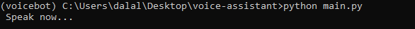

# Speech-to-Text Voice Assistant

This project is a simple Python-based voice assistant that:

- Converts audio input to text
- Generates responses using OpenAI's API
- Converts responses back to audio

## 1. Features
- Speech recognition → SpeechRecognition  
- Text-to-speech → pyttsx3  
- AI-powered responses → OpenAI API  

## 2. Files Structure
- `main.py` → main script of the voice assistant

## Screenshots


## 3. Installation
- Create and activate a conda environment:
```bash
conda create -n voicebot python=3.10
conda activate voicebot

- Install dependencies:

conda install -c conda-forge pyaudio
pip install SpeechRecognition pyttsx3 openai

Output: "Hi! How can I help you today?"

